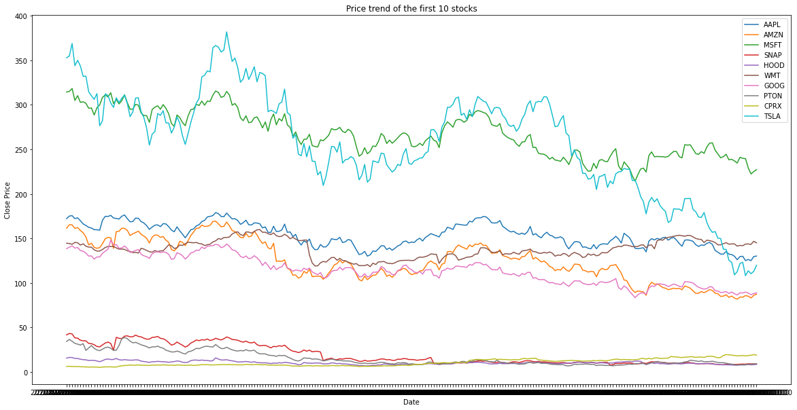
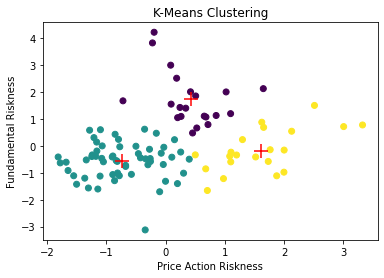
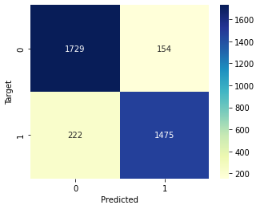
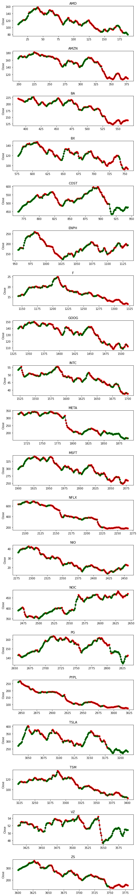

# Unsupervised and supervised learning techniques on 100 stocks and related tweets

KDD Analysis on 100 stocks, using clustering algorithms and machine learning to predict the stock prices using previous prices and sentiment analysis on related tweets.

## Part 1: KDD Analysis

The goal of this analysis is to evaluate the riskness of the stocks using daily Open/High/Low/Close data (from 2022-01-10 to 2023-01-09) combined with various indicators such as P/E, debt/equity ratio, etc, using PCA and clustering algorithms to identify stocks with similar levels of risk.

The parameters used to evaluate the riskiness of the actions are:

- **Volatility**;
- **Volume Standard Deviation**;
- **Price Standard Deviation**;
- **Trailing P/E**: high values (> 13-15) could mean that the company is overrated and it could have big price swings;
- **Total Debt/Equity (mrq)**: high debt ratio could mean that the company is investing a lot or has a lot of expenses, so could be more impredictible in the future;
- **Beta (5Y Monthly)**: measure of the systematic risk of a stock compared to the market as a whole (usually SP500). Values < 1.0 means that the stock is less volatile than the market, and vice versa:
- **52-Week Change 3**: range designated by the highest and lowest price of a stock over the previous year.

Clustering was performed with two algorithms: K-means and hierarchical, obtaining this clusters:

We can to identify three stock clusters with similar risk levels:

- Cluster on the left (green): medium-low price action risk and medium-low fundamental risk;
- Central cluster (purple): medium price-action risk and medium-high fundamental risk;
- Cluster on the right (yellow): medium-high price-action risk and medium fundamental risk.

The use cases of such an analysis can be many. For example, an asset management / investment firm could use clustering of this type to propose different types of stock / ETF packages to clients with similar risk propension propensity. It could even be done clustering with the same objectives (identifying various levels of risk appetite) on customer data so that it can be matched with the most suitable actions for them.

## Part 2: Predictive Task

Different learning models were used using previous stock prices and the result of sentiment analysis on tweets related to the stocks.

The models used for this predictive task are:

- **Logistic Regression**: 65% average accuracy;
- **Random Forest**: 87% average accuracy;
- **Gaussian Naive Bayes Classifier**: 60% average accuracy;
- **Gradient Boosting Classifier**: 90% average accuracy.

In particular, the confusion matrix resulting from the analysis of the predictions made by the Gradient Boosting Classifier model is the following:

The predictions made on the prices are as follows (green = the model predicted that the price will go up, red = vice versa):

All 4 models tested performed acceptably (we consider a model to be acceptable if it has an accuracy of >=50%, i.e. if it gets it right more times than it misses). Specifically, the models that have performed best on our datasets are Random Forest and Gradient Boosting.

Random Forest and Gradient Boosting are known for their strong performance in machine learning tasks due to their ability to handle complex relationships and capture non-linear patterns in the data. These models excel in handling high-dimensional datasets, handling missing values, and reducing overfitting. Additionally, their ensemble nature allows them to combine multiple weak learners to make more accurate predictions. The ensemble methods used by Random Forest (bagging) and Gradient Boosting (boosting) help mitigate bias and variance issues, resulting in improved performance compared to other models.

Logistic Regression and Gaussian Naive Bayes models may have performed worse compared to Random Forest and Gradient Boosting due to their limitations in capturing non-linear relationships, assuming feature independence, and their simplicity compared to ensemble methods. The performance difference can be attributed to the models' ability to handle complex patterns and reduce bias/variance.
